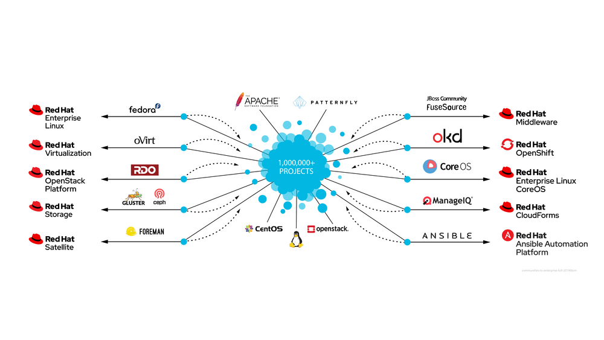

- Red Hat Directory Server - https://en.wikipedia.org/wiki/389_Directory_Server
- Red Hat Single Sign On (RHSSO) - https://www.keycloak.org/
- Red Hat OpenShift -https://www.okd.io/ (https://www.redhat.com/en/blog/what-open-source-upstream)
- Shipwright is the upstream project of OpenShift Builds v2
- Satellite 6 Component Versions - https://access.redhat.com/articles/1343683
- Ansible Tower - https://www.redhat.com/en/resources/awx-and-ansible-tower-datasheet

